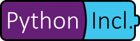

# Python.Included

Python.Included is an automatic deployment mechanism for .NET packages which depend on the embedded Python distribution. This allows  libraries depending on Python and/or Python packages to be deployed via Nuget without having to worry about any local Python installations. 

It packages embedded Python (python-3.7.3-embed-amd64.zip) in its .NET assembly and automatically deploys it in the user's home directory upon first execution. On subsequent runs, it will find Python already deployed and therefor doesn't install it again. Numpy.NET also packages the NumPy wheel and installs it into the embedded Python installation when not yet installed.

### Getting Started

Just reference Python.Included via NuGet and you are ready to interop with [Python.NET](http://pythonnet.github.io/). It is completely irrelevant wether or not you have any local Python installations of any kind.

### Projects using Python.Included
* [Numpy.NET](https://github.com/SciSharp/Numpy.NET)

### License
Since Python.Included distributes Python, it is licensed under the [Python Software Foundation License (PSF)](https://docs.python.org/3/license.html) like Python itself. 

### Links
* [Project Announcement](https://henon.wordpress.com/2019/06/05/using-python-libraries-in-net-without-a-python-installation/)
